# EtOH BLE Programmer OSX 安装

## 概述

几个月前就订购了蓝牙刷机模块套件， EtOH 说要更新电路，一直等到春节后才拿到。

迫不及待开始试用，结果很不顺利，在我的 OSX 上识别不了，郁闷～～～～

经过一番周折，终于成功了，将经验和大家分享一下。

## 模块开箱照

收到的蓝牙刷机模块套件包括3个模块：USB2SER、BLE Programmer Master、BLE Programmer Slave。Master 和 Slave 模块很相似，他们的差别在这个小小的焊锡圆点上。

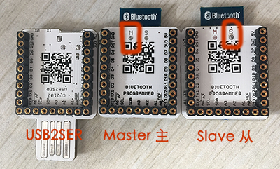 
 
参考下图安装：

将USB2SER 和 Master 叠加在一起，插入电脑的 USB。

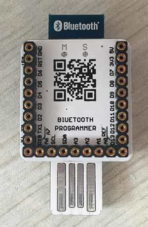

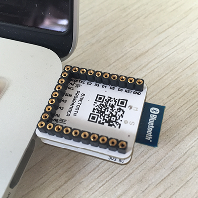 

Slave 和 Core 叠加在一起加电即可。配图直接使用了调试小红盒子，供参考。

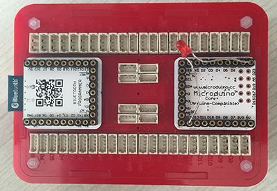

哦，为什么没有发现对应的 Port ？因为你还需要装个驱动。

## 安装USB2SER驱动

USB2SER 用到了 CP2102 芯片，驱动需要到[这里下载](https://www.silabs.com/products/mcu/Pages/USBtoUARTBridgeVCPDrivers.aspx) . 选择 MAC OSX 版本即可。

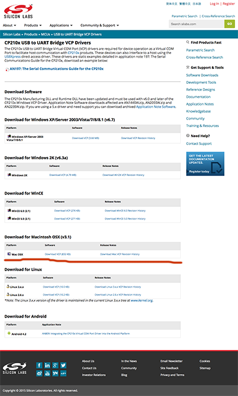

下载会得到 Mac_OSX_VCP_Driver.zip 文件，将此文件展开能够得到 SiLabsUSBDriverDisk.dmg。

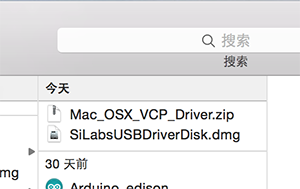

双击 SiLabsUSBDriverDisk.dmg 你能够在 Finder 里找到挂载上的新卷，这个卷里有一个可执行文件 Silicon Labs VCP Driver Installer 。直接双击安装 Silicon Labs VCP Driver Installer。

你可能会得到如下安全警告，而无法安装。

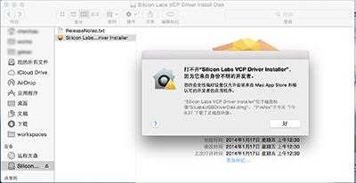

打开 OSX 的 “系统偏好设置”， 选择“安全性与隐私”，检查一下安全设置，为了安装这个驱动，我们需要允许“任何来源”的文件可安装。

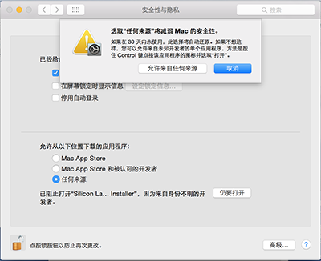

然后就能执行 Silicon Labs VCP Driver Installer 了。 跟随安装向导能够很快完成安装。

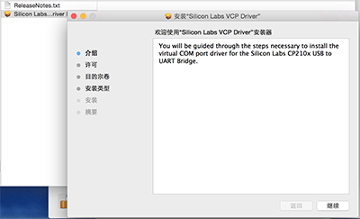

安装之后需要重启机器，然后你就能顺利看见 USB2SER 出现在 Arduino IDE 的 Port 里了。

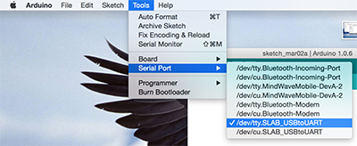

最后，f记的把“安全性与隐私”改回去啊！

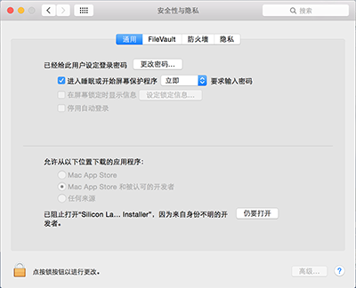

## DUANG 一下

打开 Arduino 例子里的 Blink，并在 Microduino Core 上装上 LED 小灯，DUANG ～～

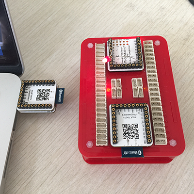

---

转载请注明出处

Author : iascchen(at)gmail(dot)com , iasc(at)163(dot)com

Date : 2015-3-3

Github : [https://github.com/iascchen/arduino_study](https://github.com/iascchen/arduino_study)

新浪微博 : [@问天鼓](http://www.weibo.com/iascchen)

---