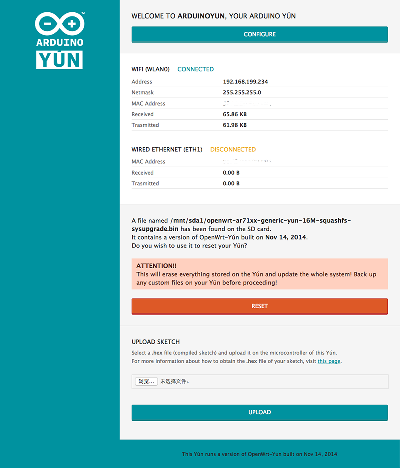

# Use Node.js DDP Client on Arduino Yun to Access Meteor Server

## 概述

在Arduino Yun上安装 Node.js, 并测试与 Meteor 通过 DDP Client 通讯。

### 所用硬件

* Arduino Yun
* SD Card（至少 2GB，我使用的是 8G ） 

### 所用软件

PC 软件： 

* Arduino IDE
* SSH Terminal（Putty / Screen）

## 升级 Arduino Yun固件

1. 从网站上下载 Arduino Yun 最新的 [openWRT 固件](http://www.arduino.cc/en/Main/Software), 当前升级包的版本是 YunSysupgradeImage_v1.5.3.zip。

2. 选用 MS-DOS 方式格式化 SD Card，将所下载的 ZIP 文件展开出的 bin 文件拷贝到 SD Card 的根目录下。

3. 将 SD Card 插入 Arduino Yun, 并重启 Arduino Yun。正常情况下，应该能够在 Web Page 点按 “RESET” 按钮执行升级。

也可以用 SSH 登陆后，先检查一下 /mnt/sda1 目录下是否有升级文件，并执行以下命令。

		# ls /mnt/sda1
		openwrt-ar71xx-generic-yun-16M-squashfs-sysupgrade.bin
		
		# run-sysupgrade /mnt/sda1/openwrt-ar71xx-generic-yun-16M-squashfs-sysupgrade.bin
		
4. 升级完成后，选择 ArduinoYun 的初始 WIFI，并通过 Web 页面访问 [192.168.240.1](http://192.168.240.1)，设置 Arduino Yun 的网络连接。
	
## 利用 SD Card 扩展 Arduino Yun 空间

Arduino Yun 的板上存储仅有 16M，要想安装更多地东西就必须利用 SD Card 扩展磁盘空间。[参考链接](http://www.arduino.cc/en/Tutorial/ExpandingYunDiskSpace)

1. 重启后，通过本地局域网，SSH 到 Arduino Yun上，检查现有的分区情况。

		# df
		Filesystem           1K-blocks      Used Available Use% Mounted on
		rootfs                    7104       364      6740   5% /
		/dev/root                 7680      7680         0 100% /rom
		tmpfs                    30560       148     30412   0% /tmp
		tmpfs                      512         0       512   0% /dev
		/dev/mtdblock3            7104       364      6740   5% /overlay
		overlayfs:/overlay        7104       364      6740   5% /
		/dev/sda1              7746772      1008   7745764   0% /mnt/sda1

2. 下载 [YunDiskSpaceExpander.zip](http://arduino.cc/en/uploads/Tutorial/YunDiskSpaceExpander.zip)

3. 通过 USB 连接 Arduino Yun，打开 Arduino IDE 上传此 ino 文件, 然后打开 Serial Monitor，在屏幕右下方选择 “Newline”, 并按照提示进行操作。下面的操作记录了我为分区方式，供参考。需要注意的是，此处输入的 4096 的意思是，将 4G 的空间保留为 /mnt/sda1 下的数据存储，**剩下的空间**留给根目录。整个过程需要等待几分钟。

		Open the Serial Monitor and double check the dropdown menu "Newline" has been selected.

		This sketch will format your micro SD card and use it as additional disk space for your Arduino Yun.
		Please ensure you have ONLY your micro SD card plugged in: no pen drives, hard drives or whatever.
		Do you wish to proceed (yes/no)? yes

		Starting Bridge...

		Ready to install utility software. Please ensure your Arduino Yun is connected to internet.
		Ready to proceed (yes/no)? yes
		Updating software list...
		Software list updated. Installing software (this will take a while)...
		e2fsprogs mkdosfs fdisk rsync installed

		Proceed with partitioning micro SD card (yes/no)? yes
		Enter the size of the data partition in MB: 4096
		Partitioning (this will take a while)...
		Micro SD card correctly partitioned

		Creating 'arduino' folder structure...
		Copying files from Arduino Yun flash to micro SD card...
		Enabling micro SD as additional disk space... enabled

		We are done! Yeah! Now press the YUN RST button to apply the changes.

4. 按下 YUN RST 后等待系统完全重启，再次检查分区情况，可以看到，Root 目录已经被放置在 /dev/sda2 下了，大小已经被扩大。

		# df
		Filesystem           1K-blocks      Used Available Use% Mounted on
		rootfs                 3556712    120920   3257464   4% /
		/dev/root                 7680      7680         0 100% /rom
		tmpfs                    30560       100     30460   0% /tmp
		tmpfs                      512         0       512   0% /dev
		/dev/sda2              3556712    120920   3257464   4% /overlay
		overlayfs:/overlay     3556712    120920   3257464   4% /
		/dev/sda1              4186104        12   4186092   0% /mnt/sda1

## 安装 Node.js

确认 Arduino Yun 可以正常联网，然后执行以下安装 Node.js， [原文参考链接](http://blog.arduino.cc/2014/07/07/node-js-on-the-arduino-yun/)

	# opkg update
	# opkg install node
	
安装完成之后，可以用以下命令检查 Node.js 安装成功

	# node -e "console.log('Hello_Yun')"
	Hello_Yun
	
Arduino Yun 可用的所有 Package 可以在[这里](http://downloads.arduino.cc/openwrtyun/1/packages/index.html)找到。您还可以根据需要，安装更多的 Node.js 基础包，例如：

	# opkg install node-serialport
	# opkg install node-noble

## 设置 Swap 区

Arduino Yun 提供的 Node.js 包很有限，还需要通过 npm 安装更多可扩展包。但是因为 npm 所需的内存比较大，我们必须打开 Swap 才能够顺利执行，否则会报内存不足。

1. 检查现有的 Swap 设置

		# free -m
		             total         used         free       shared      buffers
		Mem:         61116        31712        29404            0         8364
		-/+ buffers:              23348        37768
		Swap:            0            0            0

2. SSH 登陆后，创建 Swap 分区，这一步要等比较长的时间。

		# mkdir /swap
		
		# dd if=/dev/zero of=/swap/yunswapfile bs=1M count=1024
		1024+0 records in
		1024+0 records out

3. 设置 Swapon，此时已经可以看到 Swap 区正确创建了。

		# mkswap /swap/yunswapfile
		# swapon /swap/yunswapfile
		
		# free -m
	             	total         used         free       shared      buffers
		Mem:         61116        59704         1412            0         7676
		-/+ buffers:              52028         9088
		Swap:      1048572            0      1048572

4. 设置启动时自动加载 Swap。重启 Arduino Yun 后，Swap 区应该正常。

		# uci add fstab swap
		# uci set fstab.@swap[0].device=/swap/yunswapfile
		# uci set fstab.@swap[0].enabled=1
		# uci set fstab.@swap[0].fstype=swap
		# uci set fstab.@swap[0].options=default
		# uci set fstab.@swap[0].enabled_fsck=0
		# uci commit
		
## 安装 DDP Client

此时，我们再使用 npm 安装 DDP Client。我使用的 DDP Client 是 [https://www.npmjs.com/package/ddp](https://www.npmjs.com/package/ddp)

	# npm install ddp
	# npm install underscore

	# npm list
		/root
		├─┬ ddp@0.11.0
		│ ├── ddp-ejson@0.8.1-3
		│ ├── ddp-underscore-patched@0.8.1-2
		│ ├─┬ faye-websocket@0.9.4
		│ │ └─┬ websocket-driver@0.5.4
		│ │   └── websocket-extensions@0.1.1
		│ └─┬ request@2.53.0
		│   ├── aws-sign2@0.5.0
		│   ├─┬ bl@0.9.4
		│   │ └─┬ readable-stream@1.0.33
		│   │   ├── core-util-is@1.0.1
		│   │   ├── inherits@2.0.1
		│   │   ├── isarray@0.0.1
		│   │   └── string_decoder@0.10.31
		│   ├── caseless@0.9.0
		│   ├─┬ combined-stream@0.0.7
		│   │ └── delayed-stream@0.0.5
		│   ├── forever-agent@0.5.2
		│   ├─┬ form-data@0.2.0
		│   │ └── async@0.9.2
		│   ├─┬ hawk@2.3.1
		│   │ ├── boom@2.7.2
		│   │ ├── cryptiles@2.0.4
		│   │ ├── hoek@2.14.0
		│   │ └── sntp@1.0.9
		│   ├─┬ http-signature@0.10.1
		│   │ ├── asn1@0.1.11
		│   │ ├── assert-plus@0.1.5
		│   │ └── ctype@0.5.3
		│   ├── isstream@0.1.2
		│   ├── json-stringify-safe@5.0.1
		│   ├─┬ mime-types@2.0.13
		│   │ └── mime-db@1.11.0
		│   ├── node-uuid@1.4.3
		│   ├── oauth-sign@0.6.0
		│   ├── qs@2.3.3
		│   ├── stringstream@0.0.4
		│   ├── tough-cookie@1.2.0
		│   └── tunnel-agent@0.4.0
		└── underscore@1.8.3
		
	
# 使用 DDP Client 访问 Meteor

下面的参考实现展示了如何用 DDP Client 与 Meteor 交互。

	    var DDPClient = require("ddp"),
        _ = require('underscore');

    var ddpclient = new DDPClient({
        // url: 'ws://192.168.199.240:3000/websocket'
        url: 'ws://mcotton-01.chinacloudapp.cn/websocket'
    });

    var useremail = "iasc@163.com";
    var pwd = "123456";

    var user_id = null, token = null;

    var appkit_weather_station, myappkit_weather_station, my_app_kit_id;
    var data_observer, control_observer;

    /*
     * Connect to the Meteor Server
     */
    ddpclient.connect(function (error, wasReconnect) {
        // If autoReconnect is true, this callback will be invoked each time
        // a server connection is re-established

        if (error) {
            console.log("DDP connection error!");
            return;
        }

        if (wasReconnect) {
            console.log("Reestablishment of a connection.");
        }

        console.log("connected!");

        ddpclient.call("login", [
            {user: {email: useremail}, password: pwd}
        ], function (err, result) {
            console.log(result);
            user_id = result.id;
            token = result.token;

            if (token) {
                console.log("Logined!", user_id, token);

                //var observer = ddpclient.observe("appkits");

                /*
                 * Subscribe to a Meteor Collection
                 */
                ddpclient.subscribe(
                    "appkits",                  // name of Meteor Publish function to subscribe to
                    [],                       // any parameters used by the Publish function
                    function () {             // callback when the subscription is complete
                        console.log("appkits all ==> ", ddpclient.collections.appkits);

                        appkit_weather_station = _(ddpclient.collections.appkits).findWhere({name: 'Weather Station'});
                        console.log("appkits weather_station  ==> ", appkit_weather_station);
                        console.log("appkits weather_station id ==> ", appkit_weather_station._id);

                        // Create myAppKit

                        var myAppKit = ddpclient.call(
                            'myAppKitInsert',
                            [{
                                name: 'My Weather Station',
                                app_kit_id: appkit_weather_station._id
                            }],
                            function (err, result) {
                                console.log('myAppKitInsert, error: ' + error);
                                console.log('myAppKitInsert, result: ' + result._id);

                                my_app_kit_id = result._id;

                                /*
                                 * Subscribe to a Meteor Collection
                                 */
                                ddpclient.subscribe(
                                    "myappkits",                  // name of Meteor Publish function to subscribe to
                                    [user_id],          // any parameters used by the Publish function
                                    function () {             // callback when the subscription is complete
                                        console.log("myappkits all ==> ", ddpclient.collections.myappkits);

                                        console.log("appkit_weather_station id ==> ", appkit_weather_station._id);

                                        myappkit_weather_station = _(ddpclient.collections.myappkits).filter({_id: my_app_kit_id});
                                        console.log("myappkits weather_station  ==> ", myappkit_weather_station);
                                    }
                                );

                                ddpclient.subscribe(
                                    "dataevents",                  // name of Meteor Publish function to subscribe to
                                    [user_id],          // any parameters used by the Publish function
                                    function () {             // callback when the subscription is complete
                                        console.log("dataevents all ==> ", ddpclient.collections.dataevents);
                                    }
                                );

                                ddpclient.subscribe(
                                    "controlevents",                  // name of Meteor Publish function to subscribe to
                                    [user_id],          // any parameters used by the Publish function
                                    function () {             // callback when the subscription is complete
                                        console.log("controlevents all ==> ", ddpclient.collections.controlevents);
                                    }
                                );

                                /*
                                 * observe DataEvents
                                 */
                                data_observer = ddpclient.observe("dataevents");

                                data_observer.added = function (id) {
                                    console.log("[ADDED] to " + data_observer.name + ":  " + id);

                                    var event = _(ddpclient.collections.dataevents).findWhere({_id: id});
                                    console.log("[ADDED] dataevents ", event)
                                };

                                /*
                                 * observe ControlEvents
                                 */
                                control_observer = ddpclient.observe("controlevents");

                                control_observer.added = function (id) {
                                    console.log("[ADDED] to " + control_observer.name + ":  " + id);

                                    var event = _(ddpclient.collections.controlevents).findWhere({_id: id});
                                    console.log("[ADDED] controlevents ", event)
                                };

                                /*
                                 * Send new Control Event to Server
                                 * */
                                var newControlEvent = ddpclient.call(
                                    'controlEventInsert',
                                    [{
                                        my_app_kit_id: my_app_kit_id,
                                        control_name: "Status",
                                        control_value: "true"
                                    }],
                                    function (err, result) {
                                        console.log('controlEventInsert, error: ' + error);
                                        console.log('controlEventInsert, result: ' + result._id);
                                    });
                            }
                        );
                    }
                );
            }
        });

        ////Debug information
        //
        //ddpclient.on('message', function (msg) {
        //    console.log("ddp message: " + msg);
        //});

        /*
         ddpclient.on('socket-close', function (code, message) {
         console.log("Close: %s %s", code, message);
         });

         ddpclient.on('socket-error', function (error) {
         console.log("Error: %j", error);
         });
         */

        // close

        setTimeout(function () {
            // observer.stop();
            ddpclient.close();
        }, 5000);

    });

---

## 代码地址 ##

[https://github.com/iascchen/arduino_study/tree/master/src/yun_ddp](https://github.com/iascchen/arduino_study/tree/master/src/yun_ddp)

---

转载请注明出处

Author : iascchen(at)gmail(dot)com

Date : 2015-6-3

Github : [https://github.com/iascchen/arduino_study](https://github.com/iascchen/arduino_study)

新浪微博 : [@问天鼓](http://www.weibo.com/iascchen)

---