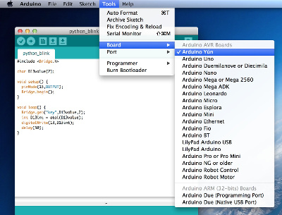
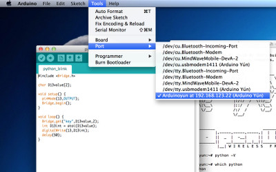
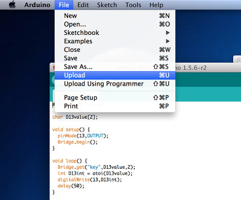
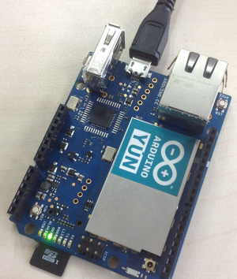

# Arduino Yun 开整 #
### 之 通过 Python 控制 D13 指示灯 ###

入手 Arduino Yun 的原因，除了它集成 WIFI 之外，就是它支持与 Python 的交互了。

了解 Arduino Uno 的同学，可能玩过驱动 D13 引脚的板载指示灯闪烁的栗子。下面，我们把这个栗子改成，通过 Python 程序开关 D13 指示灯。

## 概述 ##

Arduino Yun 在一块板子上包括以下两个部分，这两部分的信息交互，由 Bridge 完成。

* 8-Bit AVR MCU (ATmega32u4 with 32kB Flash and 2.5kB RAM running at 16MHz)，即我们通常所说的 Arduino 部分。
* 32-Bit MIPS CPU (Atheros AR9331 with 16MB Flash and 64MB RAM running at 400MHz), 运行 OpenWRT（Linino）。

Arduino Yun 上的 Python，运行于 AR9331 的 Linino 上，需要通过 Bridge 包，才能够和 Arduino 引脚交互。详情可以参考[Understanding Arduino Yún's bridge](http://jpmens.net/2013/09/23/understanding-arduino-yun-s-bridge/) 这篇文章。

## Arduino 端 Sketch ##

首先，需要在 Arduino IDE 中上传以下的 Sketch 代码，存储为 python_blink.ino。

    #include <Bridge.h>

    char D13value[2];

    void setup() {
      pinMode(13,OUTPUT);
      Bridge.begin();
    }

    void loop() {
      Bridge.get("key",D13value,2);
      int D13int = atoi(D13value);
      digitalWrite(13,D13int);
      delay(50);
    }

上传 Sketch 代码：

## Linino 端 Python ##

其次，SSH 到 Arduino Yun 的 Linino 上：

    $ ssh -l root arduinoyun.local
    root@arduinoyun.local's password:

    BusyBox v1.19.4 (2013-08-07 16:16:02 CEST) built-in shell (ash)
    Enter 'help' for a list of built-in commands.

          ___                   ___                       ___           ___
         /\__\      ___        /\__\          ___        /\__\         /\  \
        /:/  /     /\  \      /::|  |        /\  \      /::|  |       /::\  \
       /:/  /      \:\  \    /:|:|  |        \:\  \    /:|:|  |      /:/\:\  \
      /:/  /       /::\__\  /:/|:|  |__      /::\__\  /:/|:|  |__   /:/  \:\  \
     /:/__/     __/:/\/__/ /:/ |:| /\__\  __/:/\/__/ /:/ |:| /\__\ /:/__/ \:\__\
     \:\  \    /\/:/  /    \/__|:|/:/  / /\/:/  /    \/__|:|/:/  / \:\  \ /:/  /
      \:\  \   \::/__/         |:/:/  /  \::/__/         |:/:/  /   \:\  /:/  /
       \:\  \   \:\__\         |::/  /    \:\__\         |::/  /     \:\/:/  /
        \:\__\   \/__/         /:/  /      \/__/         /:/  /       \::/  /
         \/__/                 \/__/                     \/__/         \/__/

                _______                     ________        __
               |       |.-----.-----.-----.|  |  |  |.----.|  |_
               |   -   ||  _  |  -__|     ||  |  |  ||   _||   _|
               |_______||   __|_____|__|__||________||__|  |____|
                        |__| W I R E L E S S   F R E E D O M

    root@Arduinoyun:~# python -V
    Python 2.7.3
    root@Arduinoyun:~# which python
    /usr/bin/python
    root@Arduinoyun:~# cd /mnt/sda1
    root@Arduinoyun:/mnt/sda1# cd workspaces/
    root@Arduinoyun:/mnt/sda1/workspaces# vi blink.py

编辑 blink.py 内容如下：

    #!/usr/bin/python

    '''
    This file is used with sketch : python_blink.ino

    '''

    import sys
    sys.path.insert(0, '/usr/lib/python2.7/bridge/')

    from bridgeclient import BridgeClient as bridgeclient

    if __name__ == '__main__':
        try:
            raw = sys.argv[1]
        except IndexError as e1:
            raw = raw_input('>>> Input (0 or 1) : ')

        _client = bridgeclient()
        _client.put('key', raw)
        print _client.get('key')

设置此文件为可执行：

    root@Arduinoyun:/mnt/sda1/workspaces# ls
    blink.py
    root@Arduinoyun:/mnt/sda1/workspaces# chmod +x blink.py

打开 D13 指示灯：

    root@Arduinoyun:/mnt/sda1/workspaces# ./blink.py 1
    1

关闭 D13 指示灯

    root@Arduinoyun:/mnt/sda1/workspaces# ./blink.py 0
    0

---
## 代码地址 ##

[https://github.com/iascchen/arduino_study/](https://github.com/iascchen/arduino_study/)

---

玩的开心！

---

转载请注明出处

Author : iascchen(at)gmail(dot)com

Date : 2014-5-1

Github : [https://github.com/iascchen/arduino_study](https://github.com/iascchen/arduino_study)

新浪微博 : [@问天鼓](http://www.weibo.com/iascchen)

CSDN : [http://blog.csdn.net/iascchen](http://blog.csdn.net/iascchen)

---