# Microduino BT 模块 iBeacon 实践

## 概述

利用 Microduino 进行 iBeacon 实验的过程走了一些弯路，有些经验和教训记录下来，供大家参考。

请注意，以下试验中, **不要** 把 FT232R 和 BT 模块直接进行堆叠。

### 所用硬件

* FT232R
* BT
* 面包线若干
* Micro USB 线
* Core / Core+ (非必须)

### 所用软件

PC 软件： 

* Arduino IDE
* 串口调试助手
* HM-10 蓝牙模块官方固件升级软件

移动 APP：

* iBeacon Locate
* LightBlue（非必须）

## 直接利用 FT232R 与 BT 模块通讯

### 所用硬件

* FT232R
* BT
* 面包线若干
* Micro USB 线

### 连线方式

注意 **不要** 直接把 FT232R 和 BT 模块进行堆叠。

而是采用如下连接：

    FT232R  <-->    BT 
    
    GND     <-->    GND
    3V3     <-->    3V3
    RST     <-->    RST
    RX0     <-->    TX1
    TX1     <-->    RX0

将 FT232R 插入 USB，加电后，应该能够看到 BT 模块的指示灯在闪烁。

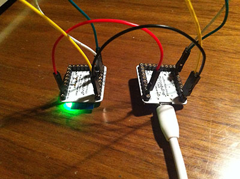

打开 Arduino IDE，并选择正确的串口。

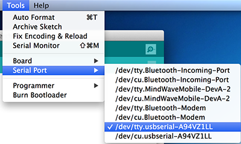

打开串口通讯器，将波特率设置为 9600，No Line Ending

输入 `AT`，如果一切正常，能够看到返回 `OK`
 
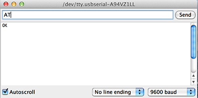

接下来可以逐行输入并发送以下指令，以检查 BT 模块是否正常。

    AT 
    AT+NAME? 
    AT+ADDR? 
    AT+UUID? 
    AT+CHAR? 
    AT+VERS?
 
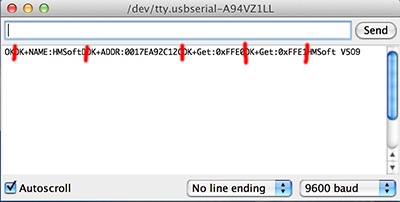
 
从图中可以看出，当前模块的版本号为： `HMSoft V509` 。

Microduino BT 模块采用的是 **HM-10** 的蓝牙模块，只有在固件版本 v516 之后才能支持 iBeacon，所以不得不进行固件升级。幸运的是，v508 之后就支持串口升级了。

## 利用串口对 BT 模块固件升级 ##

注意 **升级有风险，变砖别找我** ！

HM-10 蓝牙模块的供应商只提供了 Windows 版的升级软件。我的环境是 Win7 32位。

你可以下载 **串口调试助手** 或其他合适的串口调试工具，以方便下面的工作。

### 下载官方固件升级软件和固件包

Microduino BT 模块采用的是 **HM-10，CC2540** 芯片的蓝牙模块，当前最新版本是 v531。

其固件升级文档和包请前往 [http://www.jnhuamao.cn/download_rom.asp](http://www.jnhuamao.cn/download_rom.asp) 选择最新版本下载。

* HM-10、HM-11、HM-15固件升级指南
* HM-10 HMSoft CC2540 V531 firmware upgrade file

以及需要下载左侧快速导航中的手册，以了解各个指令：

* 4.0蓝牙模块手册

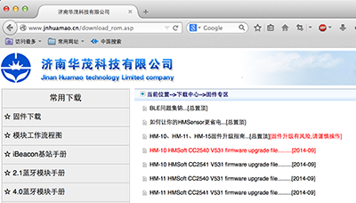

在升级前，请务必仔细阅读一下升级指南文档：

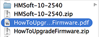

### 利用串口调试助手找到对应的 COM 口编号

1. 输入 `AT`，能够看到返回 `OK`
2. 输入 `AT+VERS?`，确认所操作蓝牙模块的名称和版本

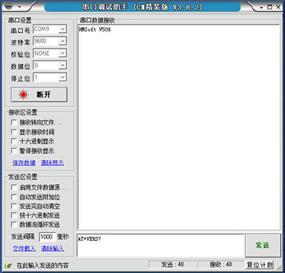

### 直接使用官方固件升级软件

直接使用官方固件升级软件不会成功，避免了不必要的误操作，赞一个。请注意选择正确的 COM 口编号和BIN文件，然后点按 “Load Image” 按钮。

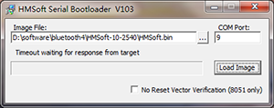

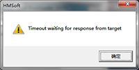

### 先设置进入升级模式，再使用官方固件升级软件

正确的做法是，先输入 `AT+SBLUP` 进入升级模式。

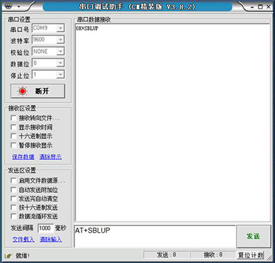

然后关闭串口调试程序。再使用官方固件升级软件。

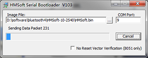

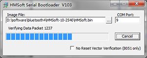

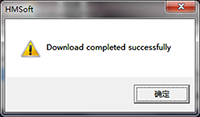

安装完成后，使用串口调试工具发送 `AT` 和 `AT+VERS?` 确认升级成功。

### 变砖教训和恢复

我第一次升级时，没有连接 RST 引脚（感谢 @袖手蹲 告知需要接 RST ），结果升级完成之后，出了点状况，现象如下，供大家借鉴：

* 重新加电之后，发现模块状态灯能够正常闪烁。
* 采用 LightBlue 手机应用，能够发现名为 HMSoft 的蓝牙服务。
* 发送 `AT` 之后，不返回 `OK` ，而且状态灯熄灭。
* 发送其他串口指令无反应。
* 因为 HM10 模块已经脱离了升级模式，所以此时也没法再强制升级和刷新。

经过研究文档，怀疑以上现象可能是模块的某些状态参数设置有问题，经过死马当做活马医的各种尝试，最后利用以下办法恢复正常：

1. 重新加电，使模块状态灯正常闪烁。
2. 将模块的 PIO0 引脚强行接低电平，用接 GND 的面包线，点一下 PIO0，恢复出厂缺省设置。（右侧从下数第二个）
3. 将模块的 RESETB 引脚强行接低电平，用接 GND 的面包线，点一下 RESETB，重置模块。RESETB 接地时，此时能看到状态灯闪烁。（做左侧从下数第三个）

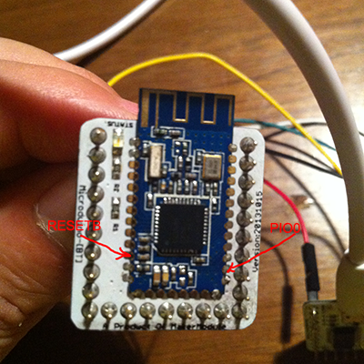

再次使用串口调试工具发送 `AT` ，发现正常返回`OK`，发送 `AT+VERS?` 返回已经升级到 v531。

## iBeacon 验证 ##

要实验 iBeacon 需要为蓝牙模块开启 iBeacon 模式：

对串口输入 `AT+IBEA?` 查询当前 iBeacon 状态，返回 0 表示未开启。输入 `AT+IBEA1` 开启 iBeacon 模式。

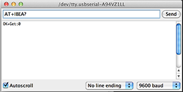

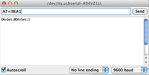

使用支持 BLE 4.0 的 iPhone （4S 以上）或 iPad （3 以上），安装 iBeacon Locate 应用， 并将手机上的 **隐私中的定位服务对此应用打开** 。

点击 “Locate iBeacons” 按钮，就能够发现名为 “Apple AirLocate 74278BDA” 的 iBeacon 模块。并能够查看其距离，和进行校准。

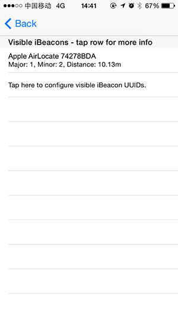

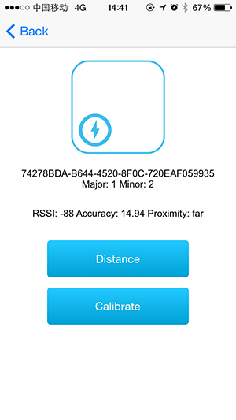

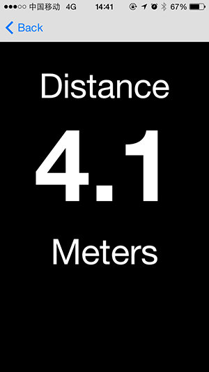

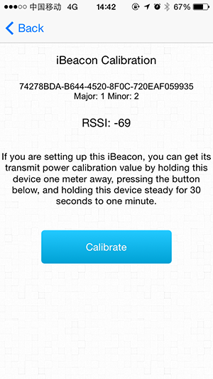

从下图看，利用 iBeacon测距并不准确，这是因为 iBeacon 测距是利用信号强度来估算距离的，这也是为什么用 iBeacon 只能判断远中近范围的原因。

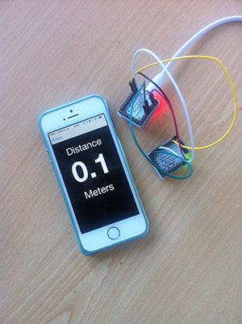

## 利用 Core / Core+ 实现与 BT 的批量设置和交互 ##

在实验过程中，因为我 **没有** 将隐私中的定位服务对此应用打开，所以数次实验均不能发现 iBeacon。

为了能够尽快的查看和设置蓝牙模块的各种参数，写了以下的 Arduino Sketch 程序，方便测试。

### 利用 SoftSerial 与 BT 模块通讯

此程序使用到了 SoftSerial 包，能够将串口发出的指令，转发给 BT 模块。

### 所用硬件

* FT232R， 堆叠 Core / Core+
* BT
* 面包线若干
* Micro USB 线

### 连线方式

    FT232R + Core   <-->    BT 
    
    GND             <-->    GND
    3V3             <-->    3V3
    RST             <-->    RST
    D9              <-->    RX0
    D10             <-->    TX1

### 利用 SoftSerial 与 BT 模块通讯

下面的代码引用自 BLE_UART.ino 的例子，展现了一个最简框架，用于将串口输入转发给 SoftSerial ，并接受其返回的内容：

    #include <SoftwareSerial.h>
    
    String tmp="";
    
    const int bleRx = 9, bleTx = 10;  // connect to BT Module RT0(D0) , TX1(D1)
    SoftwareSerial bleSerial(bleRx, bleTx); // RX, TX
    
    void setup()
    { 
      // set the data rate for the SoftwareSerial port
      bleSerial.begin(9600);
    
      // start serial port at 9600 bps and wait for port to open:
      Serial.begin(9600);
      while (!Serial) {
        ; // wait for serial port to connect. Needed for Leonardo only
      }
      Serial.println("Serieal Ready");
    }
    
    void loop() {
    
      while (bleSerial.available() > 0)  {
        tmp += char(bleSerial.read());
        delay(2);
      }
    
      if(tmp.length() > 0) {
        Serial.println(tmp);
        tmp = "";
      }
    
      if (Serial.available()) {
        bleSerial.write(Serial.read());
      }
    }
    
其交互效果与本文第二部分相当，不过我们可以换行了。

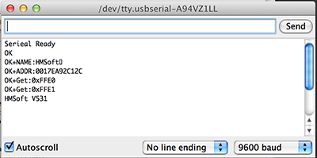

### 批量指令交互

下面的 BLE_UART_DIAG.ino 代码实现了通过向串口发送制指定指令，进行批量设置的功能。你也可以直接在串口中输入 BLE 指令。

    /**
     * Use SoftwareSerial to access microduino BT module in batch mode.
     * 
     * Send command from serieal:
     * d : Diagnostic
     * s : Set iBeacon mode
     * r : Renew
     * h : Help
     * 
     * You also can Send other BLE command such as : AT or AT+XXX
     **/
    #include <SoftwareSerial.h>
    
    // General
    byte cmdByte;
    const int interval = 1000;
    
    // Diagnostic
    char* diag_cmds[] = {
      "AT" , 
      "AT+VERS?",
      "AT+NAME?", 
      "AT+ADDR?", 
      "AT+UUID?", 
      "AT+CHAR?", 
    
      "AT+MODE?",
      "AT+RSSI?",
      "AT+NOTI?", 
    
      "AT+BAUD?", 
      "AT+PARI?",
      "AT+STOP?", 
      "AT+BIT7?", 
    
      "AT+ADVI?", 
      "AT+BATT?",
      "AT+PIO1?",
    
      //"AT+ROLE?",
    
      "AT+IBEA?",
      "AT+IBE0?", 
      "AT+IBE1?",
      "AT+IBE2?",
      "AT+IBE3?",
      "AT+MARJ?", 
      "AT+MINO?",
      "AT+MEA??",
      "AT+PWRM?",
      "AT+POWE?"};
    
    char* ibeacon_cmds[] = {
      "AT+RENEW" , 
      "AT+RESET" ,
    
      "AT", 
      "AT+MARJ0x0001",
      "AT+MINO0x0002", 
      "AT+ADVI5", 
      "AT+NAMEDOPEY", 
      "AT+ADTY3",
      "AT+IBEA1",
      "AT+DELO2",
      "AT+PWRM0", 
    
      "AT+RESET"};
    
    char* renew_cmds[] = {
      "AT+RENEW",
      "AT+RESET",
      "AT"}; 
    
    char **cmdSet;
    char *blecmd;
    String tmp="";
    
    int i, len;
    
    const int bleRx = 9, bleTx = 10;  // connect to BLE Module RT0(D0) , TX1(D1)
    SoftwareSerial bleSerial(bleRx, bleTx); // RX, TX
    
    void showBleSerialReturn(){
      while (bleSerial.available() > 0)  {
        tmp += char(bleSerial.read());
        delay(2);
      }
    
      if(tmp.length() > 0) {
        Serial.print("\t");
        Serial.println(tmp);
      }
      else{
        if (i < len){
          Serial.println();
        }
      }
    }
    
    void sendBleCmds(){
      if (i < len){
        blecmd = cmdSet[i++];
        Serial.print(blecmd);
        bleSerial.write(blecmd);
    
        delay(interval);
      }
    }
    
    void processCommand(){
      if (Serial.available() > 0) {
        cmdByte = Serial.read();
    
        switch (cmdByte) {
        case 'd' :
          Serial.println("\n==> Diagnostic...");
          cmdSet = diag_cmds;
          len = sizeof(diag_cmds) / sizeof(char*);
          i = 0;
          break;
    
        case 's' :
          Serial.println("\n==> Set iBeacon...");
          cmdSet = ibeacon_cmds;
          len = sizeof(ibeacon_cmds) / sizeof(char*);
          i = 0;
          break;
    
        case 'r' :
          Serial.println("\n==> Renew...");
          cmdSet = renew_cmds;
          len = sizeof(renew_cmds) / sizeof(char*);
          i = 0;
          break;
    
        case 'h' :
          Serial.println("\n==> Help...");
          Serial.println("\nh : Help \nd : Diagnostic \ns : Set iBeacon \nr : Renew \nAT... : Other BLE Command");
          break;
    
        default:
          bleSerial.write(cmdByte);
          Serial.print(char(cmdByte));
        }
      }
    }
    
    void setup()
    { 
      // set the data rate for the SoftwareSerial port
      bleSerial.begin(9600);
    
      // start serial port at 9600 bps and wait for port to open:
      Serial.begin(9600);
      while (!Serial) {
        ; // wait for serial port to connect. Needed for Leonardo only
      }
      Serial.println("\nSerieal Ready");
    }
    
    void loop() {
      showBleSerialReturn();
      tmp = "";
    
      sendBleCmds();
    
      processCommand();
    }

下图显示了输入 `h` 和 `d` 的返回结果：

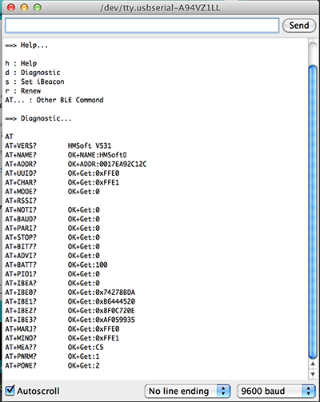

下图显示了输入 `s` 的返回结果：

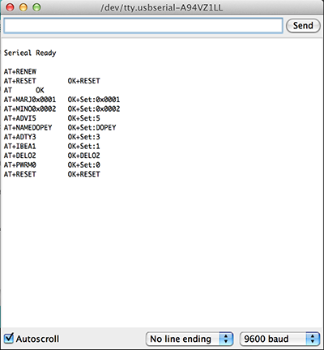

再次输入 `d` 的返回结果：

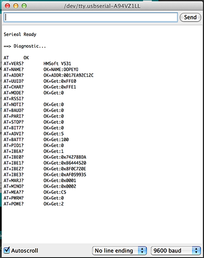

---

## 参考链接 ##

* [http://www.blueluminance.com/HM-10-as-iBeacon.pdf](http://www.blueluminance.com/HM-10-as-iBeacon.pdf)
* [http://www.jnhuamao.cn/download_rom.asp](http://www.jnhuamao.cn/download_rom.asp)

---

## 代码地址 ##

[https://github.com/iascchen/arduino_study/tree/master/src/bt_uart](https://github.com/iascchen/arduino_study/tree/master/src/bt_uart)

---

转载请注明出处

Author : iascchen(at)gmail(dot)com

Date : 2014-9-18

Github : [https://github.com/iascchen/arduino_study](https://github.com/iascchen/arduino_study)

新浪微博 : [@问天鼓](http://www.weibo.com/iascchen)

---